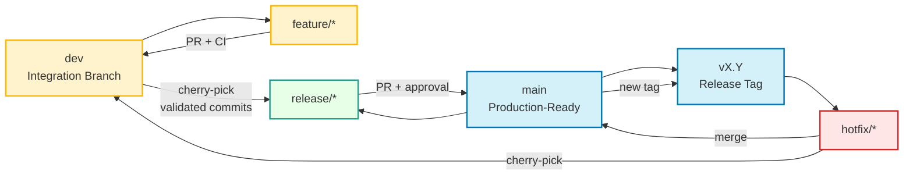

## **Git Branching, Release & Hotfix Strategy**

---

## **1. Overview**

Our team follows a **Stable Main** workflow.

* **`dev`** is the integration branch for all ongoing work.
* **`main`** is always production-ready.
* **Release tags** (`vX.Y.Z`) represent immutable, tested production baselines.
* Features are **never merged wholesale** from `dev` into `main`.

All work is validated in `dev` first.
Promotion to production happens via **explicit cherry-picking** or **hotfixes branched from release tags**.

This guarantees that `main` contains **only tested, approved, and traceable code**.

---

## **2. Branching & Release Flow Diagram**



---

## **3. Feature Development Workflow**

All new work **must start from `dev`**.

### **Phase A: Start a Feature**

```bash
git fetch -p
git checkout dev
git pull origin dev
git checkout -b FOIMOD-XXXX_description
```

---

### **Phase B: Integrate into Dev**

* Open a PR from `feature/*` → `dev`
* CI must pass
* Required approvals must be obtained
* Merge into `dev`
* Perform a **smoke test**

> **Smoke Test**
> Application starts successfully and core happy-path functionality works as expected.

---

## **4. Promoting Changes to Main (Cherry-Pick)**

We **do not merge `dev` into `main`**.

Reason:

* `dev` may contain multiple features at different readiness levels
* Merging would unintentionally release unapproved work

Instead, only **explicitly approved commits** are promoted.

---

### **Step 1: Identify Commits**

```bash
git log --oneline
```

---

### **Step 2: Create Release Bridge Branch**

Release branches always start from the latest `main`.

**Naming convention**

```text
release/<ticket>-to-main
```

```bash
git checkout main
git pull origin main
git checkout -b release/FOIMOD-XXXX-to-main
```

---

### **Step 3: Cherry-Pick Validated Commits**

```bash
# Single commit
git cherry-pick <commit-hash>

# Range of commits
git cherry-pick <start-hash>^..<end-hash>
```

---

### **Step 4: Merge into Main**

* Open PR from `release/*` → `main`
* CI must pass
* Final validation required
* Merge must be approved by a **maintainer or tech lead**

After merge, tag the release if applicable.

---

## **5. Dev-First Bug Fix Policy**

🚫 **Never fix bugs directly on `main` or release branches.**

> **Rule:** Every fix must exist in `dev` before it reaches `main`.

### **Correct Flow**

| Step | Action                             |
| ---- | ---------------------------------- |
| 1    | Fix bug in `dev`                   |
| 2    | Merge and validate                 |
| 3    | Capture commit hash                |
| 4    | Cherry-pick into release or `main` |

**Why this matters**

Fixing only in `main` causes regressions:

* The bug remains in `dev`
* It will likely reappear in the next release

---

## **6. Hotfix Workflow (Tag-Based)**

Hotfixes are used **only when production is already released** and an urgent fix is required.

### **Key Principle**

> **Hotfixes always start from a release tag, never from `main` or `dev`.**

Release tags represent **exactly what is running in production**.

---

### **Step 1: Identify the Production Tag**

Example:

```text
v22.0
```

This tag points to the commit used to build the deployed production image.

---

### **Step 2: Create Hotfix Branch from the Tag**

```bash
git fetch --tags
git checkout v22.0
git checkout -b hotfix/v22.0-FOIMOD-XXXX
```

---

### **Step 3: Apply and Test the Fix**

```bash
git commit -m "FOIMOD-XXXX: Fix <description>"
```

* Run tests
* Validate in hotfix or test environment

---

### **Step 4: Merge Hotfix into Main**

```bash
git checkout main
git pull origin main
git merge hotfix/v22.0-FOIMOD-XXXX
```

* Open PR if required
* After merge, create a new patch tag:

```bash
git tag v22.0.1
git push origin v22.0.1
```

---

### **Step 5: Backport Hotfix into Dev (Mandatory)**

```bash
git checkout dev
git pull origin dev
git cherry-pick <hotfix-commit-hash>
```

This ensures the fix is included in all future releases.

---

## **7. Conflict Resolution**

During cherry-pick or merge:

```bash
git add <file>
git cherry-pick --continue
```

Abort if necessary:

```bash
git cherry-pick --abort
```

---

## **8. Summary Cheat Sheet**

### **Feature Flow**

```
dev → feature → dev → release → main
```

### **Hotfix Flow**

```
tag → hotfix → main → tag
               ↓
              dev
```

---

## **9. What Not To Do**

* ❌ Do not merge `dev` into `main`
* ❌ Do not hotfix directly on `main`
* ❌ Do not branch hotfixes from `dev`
* ❌ Do not cherry-pick untested commits
* ❌ Do not skip backporting hotfixes to `dev`

---

## **10. Why This Strategy Works**

* `main` is always production-ready
* Production releases are traceable via tags
* Hotfixes target the exact deployed code
* `dev` remains the single source of truth
* Releases are explicit, auditable, and reproducible

---

### ✅ Status

This document defines the **mandatory branching, release, and hotfix workflow** for this repository.