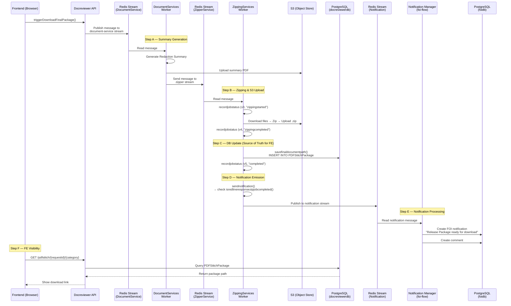

# Package Not Available to Download — Records Tab Delay Investigation

**Ticket:** FOIMOD-4540 
**Date:** 2026-03-25  
**Status:** Investigation / Technical Refinement  
**Related:** [FOIMOD-4729 — Summary of Redactions Performance Investigation](./FOIMOD-4729-investigation.md)

---

## 1. Problem Summary

### Observed Behavior

After a package (Response Package, Redline Package, etc.) is successfully created and zipped:

- The **zipped file is present in S3** (confirmed)
- The **Records tab in the frontend does not immediately reflect** that the file is available for download
- A **time gap** exists between the S3 upload completing and the UI showing the download link

This creates a **state mismatch**:

| Layer | State |
|---|---|
| **S3** | ✅ File exists |
| **Database (`PDFStitchPackage`)** | ⏳ Unknown — may or may not be updated |
| **Notification (foidb)** | ⏳ Unknown — may or may not be created |
| **Frontend (Records tab)** | ❌ File not shown as available |

### Impact

- Users cannot download packages immediately after creation, even though the package is ready in S3.
- Users resort to **manually retrieving files from S3** — a workaround that bypasses the application flow.
- Delays the **response delivery workflow** — users waiting to send packages to applicants.

### Timeline

- Issue started around **December 8, 2025**.
- Workaround: manually retrieve file from S3, or wait until the UI eventually updates.

> [!IMPORTANT]
> This is a **state propagation issue**, not a generation performance issue. The package is already built and stored — the problem is in the pipeline steps *after* the S3 upload that update the database and notify the frontend.

---

## 2. End-to-End Flow Analysis

### 2.1 Full Pipeline Overview

The package creation pipeline involves **five distinct services** communicating via **Redis Streams** and **PostgreSQL**:



### 2.2 Key Components & Files

| Step | Component | File                                                                                                                                                               | Repository |
|---|---|--------------------------------------------------------------------------------------------------------------------------------------------------------------------|---|
| **A** | DocumentServices Worker | [documentservicestreamreader.py](https://github.com/bcgov/foi-docreviewer/blob/main/computingservices/DocumentServices/rstreamio/reader/documentservicestreamreader.py) | foi-docreviewer |
| **A** | Summary Service | [redactionsummaryservice.py](https://github.com/bcgov/foi-docreviewer/blob/main/computingservices/DocumentServices/services/redactionsummaryservice.py)            | foi-docreviewer |
| **A→B** | Zipper Stream Writer | [zippingstreamwriter.py](https://github.com/bcgov/foi-docreviewer/blob/main/computingservices/DocumentServices/rstreamio/writer/zipperstreamwriter.py)             | foi-docreviewer |
| **B** | Zipper Consumer | [foirediszipperconsumer.py](https://github.com/bcgov/foi-docreviewer/blob/main/computingservices/ZippingServices/services/foirediszipperconsumer.py)               | foi-docreviewer |
| **B,C** | Zipper Service | [zipperservice.py](https://github.com/bcgov/foi-docreviewer/blob/main/computingservices/ZippingServices/services/zipperservice.py)                                 | foi-docreviewer |
| **C** | DB Operations | [zipperdboperations.py](https://github.com/bcgov/foi-docreviewer/blob/main/computingservices/ZippingServices/services/zipperdboperations.py)                       | foi-docreviewer |
| **D** | Notification Service | [notificationservice.py](https://github.com/bcgov/foi-docreviewer/blob/main/computingservices/ZippingServices/services/notificationservice.py)                     | foi-docreviewer |
| **E** | Notification Processor | [notificationprocessor.py](https://github.com/bcgov/foi-flow/blob/main/notification-manager/notification_api/io/message/processor/notificationprocessor.py)    | foi-flow |
| **E** | Notification Stream Reader | [notification.py](https://github.com/bcgov/foi-flow/blob/main/notification-manager/notification_api/io/redis_stream/reader/notification.py)    | foi-flow |
| **F** | API - Package Resource | [pdfstitchpackage.py](https://github.com/bcgov/foi-docreviewer/blob/main/api/reviewer_api/resources/pdfstitchpackage.py)                       | foi-docreviewer |
| **F** | Model - PDFStitchPackage | [PDFStitchPackage.py](https://github.com/bcgov/foi-docreviewer/blob/main/api/reviewer_api/models/PDFStitchPackage.py)                          | foi-docreviewer |

---


## 3. State Synchronization Analysis

### 3.1 Source of Truth for Each Layer

| Layer | Source of Truth | How it gets updated |
|---|---|---|
| **File existence** | S3 | `uploadbytes()` in `zipperservice.__zipfilesandupload()` |
| **Package availability (for FE)** | `PDFStitchPackage` table in `docreviewerdb` | `savefinaldocumentpath()` in `zipperdboperations.py` — `INSERT INTO "PDFStitchPackage"` |
| **Job status tracking** | `PDFStitchJob` table in `docreviewerdb` | `recordjobstatus()` — version 3→4→5 progression |
| **User notification** | `FOIRequestNotifications` table in `foidb` | `notificationprocessor` via `notification-manager` |
| **FE display** | API response from `GET /pdfstitch/{requestid}/{category}` | Queries `PDFStitchPackage` table |

### 3.2 How FE Determines File Availability

The FE calls the Docreviewer API endpoint:

```
GET /api/docreviewer/pdfstitch/{requestid}/{category}
```

This queries the `PDFStitchPackage` table:

```python
# PDFStitchPackage.getpdfstitchpackage()
query = db.session.query(PDFStitchPackage)
    .filter(ministryrequestid == requestid, category == category)
    .order_by(pdfstitchpackageid.desc())
    .first()
```

**Critical insight:** The FE is **entirely dependent on the DB record** in `PDFStitchPackage`. If this record is not inserted (or is delayed), the FE cannot show the download link — regardless of whether the file exists in S3.

### 3.3 Potential Synchronization Gaps

```
S3 Upload Complete ──── GAP 1 ────> PDFStitchPackage INSERT ──── GAP 2 ────> FE API Query
                                           │
                                     GAP 3 │
                                           ▼
                                  Notification Stream ──── GAP 4 ────> Notification in foidb
```

| Gap | Between | Potential Cause |
|---|---|---|
| **GAP 1** | S3 upload → DB insert | Exception in `savefinaldocumentpath()`, DB connectivity, transaction failure |
| **GAP 2** | DB insert → FE visibility | FE polling interval, API caching, or FE not re-querying after notification |
| **GAP 3** | DB insert → notification emission | `sendnotification()` failing or being skipped due to `isredlineresponsezipjobcompleted()` returning `False` |
| **GAP 4** | Notification stream → `foidb` | Notification manager consumer lag, processing errors |

---

## 4. Hypotheses (Root Cause Candidates)

### 🔴 H1 — `sendnotification()` Returns Early Due to Job Completion Check (HIGH CONFIDENCE)

In `zipperservice.py`, after `savefinaldocumentpath()`, `sendnotification()` is called from `foirediszipperconsumer.py`:

```python
# foirediszipperconsumer.py
processmessage(producermessage)     # Does zip → S3 → DB insert
readyfornotification = True
sendnotification(readyfornotification, producermessage)
```

But `sendnotification()` in `zipperservice.py` calls `isredlineresponsezipjobcompleted()`:

```python
# notificationservice.py
def sendredlineresponsenotification(self, producermessage):
    complete, err = self.__isredlineresponsezipjobcompleted(jobid, category)
    if complete or err:
        self.__responsepackagepublishtostream(...)
    else:
        logging.info("redline zipping is not yet completed, no message to sent")
```

This check queries `PDFStitchJob` to see if the max version has `status = 'completed'`. If the version 5 record was not yet committed, or if the category mapping in `assigncategory()` produces a mismatch, **the notification is never sent**.

> [!CAUTION]
> If the notification is never sent, the FE has no way to know the package is ready — unless it polls the `PDFStitchPackage` table independently.

### 🔴 H2 — Category Mismatch in `assigncategory()` (HIGH CONFIDENCE)

The `assigncategory()` function normalizes categories:

```python
def assigncategory(category):
    if "phase" in category:
        if "redline" in category:
            return "redline"
        else:
            return "responsepackage"
    return category
```

In `recordjobstatus()`, the category gets `"-zipper"` appended: `assigncategory(category) + "-zipper"`. But in `isredlineresponsezipjobcompleted()`, the query filters by category **without** the `-zipper` suffix.

Also in `processmessage()` line 46:
```python
if message.phase not in ("", None) and ('phase' in category):
    category = message.category.replace("_", "")
```

This transforms `"responsepackage_phase1"` → `"responsepackagephase1"` **before** calling `savefinaldocumentpath()`. If the notification service later checks with the original or differently-transformed category, it will not find the matching completed job.

### 🟡 H3 — FE Does Not Poll / Uses Stale Data (MEDIUM CONFIDENCE)

The FE calls `GET /pdfstitch/{requestid}/{category}` but:
- **When** does it call it? On page load? On a timer? After receiving a notification?
- If the FE only queries the API **once** on tab load and does not re-query after the package is complete, the user would need to **refresh the page** to see the download link.
- There is no evidence of WebSocket or Server-Sent Events — the system relies on **Redis stream notifications → DB → FE polling**.

### 🟡 H4 — Notification Manager Consumer Lag (MEDIUM CONFIDENCE)

The notification manager (`notification.py`) is a simple Redis stream consumer:
```python
messages = stream.read(last_id=last_id, block=BLOCK_TIME)
```

- No consumer group — single consumer pattern, sequential processing.
- If the notification manager is slow or backlogged, the notification message sits in the stream, and the FE user notification (which might trigger a re-fetch) is delayed.
- `BLOCK_TIME = 5000` (5 seconds) — reasonable, but adds latency.

### 🟡 H5 — Exception in `savefinaldocumentpath()` Swallowed Silently (MEDIUM CONFIDENCE)

In `zipperservice.py` line 42:
```python
if result.get("success"):
    savefinaldocumentpath(result, message.ministryrequestid, category, message.createdby)
    recordjobstatus(..., status="completed")
else:
    errormessage = "Error in uploading the final document %s", result.get("filename")
```

If `savefinaldocumentpath()` **throws an exception**, it is caught by the outer `try/except` (line 73), which records the job status as `"error"`. However, the **file is already in S3** and the **zipping status was already recorded as "zippingcompleted"** (version 4). This creates the exact mismatch: file in S3, but no `PDFStitchPackage` record.

### 🟢 H6 — Redis Stream Message Delivery Issues (LOWER CONFIDENCE)

After `documentservicestreamreader.py` processes the message, it sends to the zipper stream via `zippingservice().sendtozipper()`. If this write fails or is delayed:
- The zipper consumer never receives the message.
- The file would not be zipped (but the problem states the zip is confirmed in S3, so this is less likely unless the issue is intermittent).

### 🟢 H7 — `__removesensitivecontent()` Causing Slow Zipping (LOWER CONFIDENCE)

The `zipperservice.__zipfilesandupload()` method processes **every PDF** through `__removesensitivecontent()`, which:
1. Reads the entire PDF with `PyPDF2.PdfReader`
2. Creates a new `PdfWriter`
3. Copies all pages

For large response packages (e.g., 34 MB, 1,515 pages), this could be slow. However, this would delay the zip creation itself, not the post-zip-to-FE-visibility pipeline.

---

## 5. Key Questions for Investigation

### Pipeline Integrity

1. **Is `savefinaldocumentpath()` actually succeeding?** Check if a `PDFStitchPackage` record exists for the affected requests — compare its `createdat` timestamp with the S3 object creation time.
2. **Is `sendnotification()` actually publishing to the notification stream?** Check logs for `"redline zipping is not yet completed, no message to sent"` — if this appears, H1 is confirmed.
3. **What is the category transformation chain?** For a given request, trace the category value through `processmessage()` → `savefinaldocumentpath()` → `sendnotification()` → `isredlineresponsezipjobcompleted()`.

### Frontend Behavior

4. **When does the FE query `/pdfstitch/{requestid}/{category}`?** Only on tab load, or on a polling interval?
5. **Does the FE have any real-time mechanism** (WebSocket, SSE) to receive package-ready notifications, or is it purely pull-based?
6. **Is the FE notification popup** (from notification-manager) connected to the Records tab refresh logic?

### Timing

7. **What is the timestamp on the S3 object** vs the `PDFStitchPackage.createdat` vs the `FOIRequestNotifications.createdat`?
8. **What is the timestamp of `PDFStitchJob` version 5** (`status = 'completed'`)? Compare with version 4 (`"zippingcompleted"`).

### Infrastructure

9. **Are there any pod restarts or OOM kills** for the ZippingServices or notification-manager pods around December 8, 2025?
10. **Is the Redis stream for notifications healthy?** Check stream length, consumer lag.

---

## 6. Metrics & Observability Plan

### What to Measure

| Metric | Where | How |
|---|---|---|
| **Time: zip complete → S3 upload** | `zipperservice.__zipfilesandupload()` | Timer wrapping `uploadbytes()` |
| **Time: S3 upload → `savefinaldocumentpath()`** | `zipperservice.processmessage()` | Timer between `__zipfilesandupload()` return and `savefinaldocumentpath()` call |
| **Time: `savefinaldocumentpath()` → successful commit** | `zipperdboperations.py` | Timer wrapping the INSERT + COMMIT |
| **Time: notification emission** | `notificationservice.py` | Timer on `notificationstream.add()` — log `msgid` |
| **Time: notification consumed** | `notification-manager/notification.py` | Log timestamp when message is processed |
| **Time: FOI notification created in `foidb`** | `notificationprocessor.py` | Log after `createnotification()` |
| **`PDFStitchJob` version progression** | `zipperdboperations.recordjobstatus()` | Log timestamps for each version (3, 4, 5) |
| **Notification gate result** | `notificationservice.sendredlineresponsenotification()` | Log `complete` and `err` values from `isredlineresponsezipjobcompleted()` |

### Where to Instrument

```
foirediszipperconsumer.py                   ← message received timestamp
  └─ zipperservice.processmessage()         ← total processing time
       ├─ recordjobstatus(v3)              ← zipping started
       ├─ __zipfilesandupload()            ← zip + S3 upload time
       ├─ recordjobstatus(v4)              ← zipping completed
       ├─ savefinaldocumentpath()           ← DB INSERT time ← ⚠️ CRITICAL
       ├─ recordjobstatus(v5)              ← job completed
       └─ sendnotification()               ← notification gate check ← ⚠️ CRITICAL
            └─ isredlineresponsezipjobcompleted()  ← gate query result
            └─ __responsepackagepublishtostream()  ← notification published
```

### Suggested Logging

```python
import time
import logging

# In zipperservice.processmessage()
start_save = time.time()
savefinaldocumentpath(result, message.ministryrequestid, category, message.createdby)
logging.info(f"[PERF] savefinaldocumentpath took {time.time()-start_save:.3f}s "
             f"requestid={message.ministryrequestid} category={category}")

# In notificationservice.sendredlineresponsenotification()
logging.info(f"[PERF] isredlineresponsezipjobcompleted check: "
             f"complete={complete} err={err} jobid={producermessage.jobid} "
             f"category_queried={category} original_category={producermessage.category}")
```

### Correlation ID

Currently there is no single correlation ID across the pipeline. The `jobid` from `PDFStitchJob` is the closest candidate:

```
DocumentServices message → ZippingServices message → Notification message
    (jobid mapped via message.jobid)
```

Recommend adding a `correlation_id` (UUID) set at the start of the pipeline and propagated through all stream messages and log entries.

---

## 7. Experiment Plan

### Phase 1 — Verify the DB Record Exists

**Goal:** Determine if the problem is in Step C (DB INSERT) or Step F (FE polling).

```sql
-- For an affected request, check PDFStitchPackage
SELECT pdfstitchpackageid, ministryrequestid, category, finalpackagepath, createdat
FROM "PDFStitchPackage"
WHERE ministryrequestid = <affected_ministry_request_id>
ORDER BY createdat DESC;

-- Check PDFStitchJob version progression
SELECT pdfstitchjobid, version, category, status, message, createdby
FROM "PDFStitchJob"
WHERE ministryrequestid = <affected_ministry_request_id>
ORDER BY pdfstitchjobid DESC, version ASC;

-- Compare S3 upload time with DB record creation time
-- (S3 object metadata → compare with PDFStitchPackage.createdat)
```

### Phase 2 — Verify the Notification Was Sent

**Goal:** Confirm if the notification gate passes (`isredlineresponsezipjobcompleted()` returns `True`).

1. Add logging to `notificationservice.sendredlineresponsenotification()` to log the `complete` and `err` values.
2. Check notification-manager logs for the `"Release Package ready for download"` message creation.
3. Query `foidb`:
   ```sql
   SELECT * FROM "FOIRequestNotification"
   WHERE ministryrequestid = <affected_ministry_request_id>
   AND notificationtype = 'PDFStitch'
   ORDER BY createdat DESC;
   ```

### Phase 3 — Reproduce with Controlled Request

**Goal:** Reproduce the issue and measure timestamps at each pipeline stage.

1. Deploy instrumented code to staging.
2. Trigger a package creation for a known request.
3. Record timestamps at each stage:
   - FE triggers `triggerDownloadFinalPackage()` → `T0`
   - DocumentServices receives message → `T1`
   - Summary generation completes → `T2`
   - Zipper receives message → `T3`
   - Zip + S3 upload completes → `T4`
   - `savefinaldocumentpath()` completes → `T5`
   - `sendnotification()` returns → `T6`
   - Notification manager processes message → `T7`
   - FE shows download link → `T8`
4. Calculate: `T5 - T4` (DB insert delay), `T6 - T5` (notification gate), `T8 - T5` (FE visibility delay).

### Phase 4 — Category Tracing

**Goal:** Verify category consistency across the pipeline.

Trace the `category` field at each stage for a phased request:
1. Original message category (from FE)
2. After `message.category.replace("_", "")` in `processmessage()` line 46
3. After `assigncategory()` in `recordjobstatus()`
4. Category used in `savefinaldocumentpath()`
5. Category queried in `isredlineresponsezipjobcompleted()`

---

## 8. Potential Fixes / Improvements

### 🟢 Short-Term (Quick Wins)

#### 8.1 Add Explicit Logging After S3 Upload + DB Insert + Notification

**Current:** No timing or result logging between the critical stages.

**Proposed:** Add `[PERF]` tagged logging at every critical boundary in `zipperservice.processmessage()` and `notificationservice.sendredlineresponsenotification()` to immediately identify where the delay occurs.

**Effort:** Low. Diagnostic only.

#### 8.2 Fix Potential Notification Gate Bypass

If `isredlineresponsezipjobcompleted()` is returning `False` (H1), ensure:
- The `recordjobstatus(v5, "completed")` call succeeds **before** `sendnotification()` is called.
- The category used in the completion check matches the category in the DB.

**Current flow:**
```python
savefinaldocumentpath(...)
recordjobstatus(v5, status="completed")
# ... then in foirediszipperconsumer.py:
sendnotification(readyfornotification=True, producermessage)
```

`sendnotification()` is called from `foirediszipperconsumer.py`, **after** `processmessage()` completes. The `recordjobstatus(v5)` should already be committed. But verify this with logging.

#### 8.3 Add FE Polling for Download Availability

If the FE does not poll, add a simple setInterval that queries `/pdfstitch/{requestid}/{category}` every 10–15 seconds after the user triggers package creation, until the package path is returned.

```javascript
// Pseudo-code
const pollForPackage = (requestId, category, interval = 15000) => {
  const timer = setInterval(async () => {
    const result = await fetchPDFStitchPackage(requestId, category);
    if (result && result.finalpackagepath) {
      clearInterval(timer);
      updateDownloadButton(result);
    }
  }, interval);
};
```

---

### 🟡 Mid-Term Improvements

#### 8.4 Add Explicit "package_ready" Event with Guaranteed Delivery

Instead of relying on the notification gate check (`isredlineresponsezipjobcompleted()`), emit a direct `package_ready` event to a dedicated Redis stream immediately after `savefinaldocumentpath()` succeeds.

#### 8.5 Decouple Notification from Job Completion Check

The current pattern couples notification emission to a complex DB query (`isredlineresponsezipjobcompleted()`). If this query fails or the category doesn't match, no notification is sent. Instead:
- Emit notification **unconditionally** after `savefinaldocumentpath()` succeeds.
- Let the notification manager determine if it's a real completion event.

#### 8.6 Add DB Event / Trigger for `PDFStitchPackage` INSERT

Add a PostgreSQL trigger on `PDFStitchPackage` that, on `INSERT`, publishes a `NOTIFY` event. A backend listener can then push this event to connected frontends (or to a queue).

#### 8.7 Improve Error Handling in `savefinaldocumentpath()`

The current code raises on exception but does not log the specific values that failed:

```python
# Current
cursor.execute("""INSERT INTO public."PDFStitchPackage" ...""", (ministryid, category.lower(), finalpackagepath, userid))

# Proposed: add pre-validation and detailed error logging
logging.info(f"savefinaldocumentpath: ministryid={ministryid} category={category} path={finalpackagepath}")
```

---

### 🔵 Long-Term Architectural Changes

#### 8.8 Push-Based Updates via WebSocket / SSE

Replace FE polling with a real-time push mechanism:
1. Backend emits `package_ready` event to a WebSocket server.
2. FE subscribes to the channel for the current request.
3. On event receipt, FE refreshes the Records tab.

This eliminates the polling delay entirely and provides instant feedback.

#### 8.9 Event-Driven Architecture with Guaranteed Delivery

Replace the current Redis stream pattern (no consumer groups in some consumers, no retry/DLQ) with:
- **Consumer groups** on all streams (already done for DocumentServices, but not for ZippingServices and notification-manager).
- **Dead letter queues** for failed messages.
- **Retry policies** with exponential backoff.
- **Idempotent handlers** to support safe retries.

#### 8.10 Unified Status API

Create a single API endpoint that aggregates status from all pipeline stages:

```
GET /api/docreviewer/package-status/{requestid}/{category}

Response:
{
  "status": "ready" | "processing" | "error",
  "stages": {
    "summary_generation": { "status": "completed", "timestamp": "..." },
    "zipping": { "status": "completed", "timestamp": "..." },
    "s3_upload": { "status": "completed", "timestamp": "..." },
    "db_record": { "status": "completed", "timestamp": "..." },
    "notification": { "status": "pending", "timestamp": null }
  },
  "download_url": "..." // if ready
}
```

---

## 9. Risks & Considerations

### Data Integrity

| Risk | Impact | Mitigation |
|---|---|---|
| FE showing download before file is fully ready | User downloads incomplete zip | Ensure `savefinaldocumentpath()` only runs after S3 upload success confirmation |
| Duplicate `PDFStitchPackage` records | FE may show wrong file version | The query uses `ORDER BY pdfstitchpackageid DESC LIMIT 1` — latest wins, but check for orphaned records |
| Category transformation mismatch | Notification never sent; FE never updated | Create a category mapping test suite and log all category transformations |

### Consumer Reliability

| Risk | Impact | Mitigation |
|---|---|---|
| ZippingServices consumer crashes after S3 upload but before DB insert | File in S3, no DB record | Implement transactional outbox pattern or at-least-once delivery |
| Notification manager crashes | No notification sent to user | Currently no consumer group — add consumer group + PEL recovery (like DocumentServices) |
| Redis stream data loss | Messages lost; pipeline stalls | Configure stream persistence, `MAXLEN`, and monitoring |

### Impact on Other Package Types

This investigation covers the `responsepackage` and `redline` flows. The same pipeline is used for:
- **Harms packages** (slightly different notification path via `sendharmsnotification()`)
- **Consult packages** (skip summary generation; go straight to zipping)
- **OpenInfo packages**
- **OIPC Review Redlines**

Any fix should be tested against all package types to ensure no regression.

---

## 10. Next Steps

### Immediate (Sprint)

- [ ] **Query the DB for an affected request** — verify if `PDFStitchPackage` record exists and compare timestamps with S3 object creation time (Phase 1 experiment).
- [ ] **Add logging to `isredlineresponsezipjobcompleted()`** — confirm if the notification gate is passing or blocking (H1).
- [ ] **Log category transformations** at each pipeline stage — trace the category value chain (H2).
- [ ] **Inspect FE code** to determine if/how it polls for package availability — confirm or rule out H3.

### After Confirming Root Cause

- [ ] **Fix notification gate logic** if H1/H2 confirmed — ensure notification is sent unconditionally after `savefinaldocumentpath()` success.
- [ ] **Add FE polling** if H3 confirmed — periodic check for `PDFStitchPackage` availability.
- [ ] **Add consumer group** to notification-manager stream reader — bring it in line with DocumentServices pattern.
- [ ] **Add performance logging** across all critical pipeline boundaries.

### Follow-up

- [ ] Design and implement push-based notification (WebSocket/SSE) for real-time FE updates.
- [ ] Add a unified package status API endpoint.
- [ ] Add monitoring/alerting for pipeline latency (time from trigger to FE visibility).
- [ ] Add correlation ID across all stream messages for end-to-end tracing.

---

## Appendix: File References

| File | Path |
|---|---|
| FE — Response Package Hook | `foi-docreviewer/web/src/components/FOI/Home/CreateResponsePDF/useSaveResponsePackage.js` |
| DocumentServices Stream Reader | `foi-docreviewer/computingservices/DocumentServices/rstreamio/reader/documentservicestreamreader.py` |
| Redaction Summary Service | `foi-docreviewer/computingservices/DocumentServices/services/redactionsummaryservice.py` |
| Zipping Service (DocumentServices) | `foi-docreviewer/computingservices/DocumentServices/services/zippingservice.py` |
| Zipper Stream Writer | `foi-docreviewer/computingservices/DocumentServices/rstreamio/writer/zipperstreamwriter.py` |
| Zipper Consumer | `foi-docreviewer/computingservices/ZippingServices/services/foirediszipperconsumer.py` |
| Zipper Service | `foi-docreviewer/computingservices/ZippingServices/services/zipperservice.py` |
| Zipper DB Operations | `foi-docreviewer/computingservices/ZippingServices/services/zipperdboperations.py` |
| Notification Service (Zipper) | `foi-docreviewer/computingservices/ZippingServices/services/notificationservice.py` |
| Notification Processor | `foi-flow/notification-manager/notification_api/io/message/processor/notificationprocessor.py` |
| Notification Stream Reader | `foi-flow/notification-manager/notification_api/io/redis_stream/reader/notification.py` |
| API — PDFStitchPackage Resource | `foi-docreviewer/api/reviewer_api/resources/pdfstitchpackage.py` |
| Model — PDFStitchPackage | `foi-docreviewer/api/reviewer_api/models/PDFStitchPackage.py` |
| Service — PDFStitchPackage | `foi-docreviewer/api/reviewer_api/services/pdfstitchpackageservice.py` |
| DB Schema (docreviewerdb) | `patroni-db/docreviewerdb.sql` |
