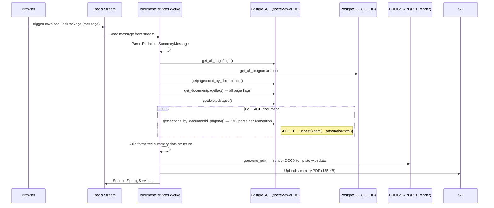

# FOIMOD-4729 — Summary of Redactions Performance Investigation

**Ticket:** FOIMOD-4729  
**Date:** 2026-03-25  
**Status:** Investigation / Technical Refinement

---

## 1. Problem Summary

### Observed Behavior

For **CFD Personal** requests, generating the **Summary of Redactions** file (part of the Response Package flow) is **orders of magnitude slower** than expected:

| Artifact | Generation Time | Output Size |
|---|---|---|
| Response Package (PDF) | ~minutes | 34 MB |
| Summary of Redactions | ~5 hours | 135 KB |

### Impact

- **Blocks users** from sending responses to applicants and closing requests.
- Summary generation holds up the entire downstream flow (zipping, notification, delivery).

### Example — CFD-2025-52688

| Metric | Value |
|---|---|
| Total Pages | 1,515 |
| Total Annotations | 2,695 |
| Response Package generated at | 7:16 AM |
| Summary generated at | 12:06 PM (~5 hours later) |
| Response Package size | 34 MB |
| Summary size | 135 KB |

> [!IMPORTANT]
> The smaller output (135 KB summary) takes dramatically longer than the larger one (34 MB response package). This strongly suggests the bottleneck is in **data gathering/processing**, not in output generation.

---

## 2. Current Flow Analysis

### 2.1 Response Package Generation (Fast — Minutes)

The Response Package is generated **entirely in the user's browser** using the **Apryse (PDFTron) WebViewer** library.

```
Browser (Apryse WebViewer)
  │
  ├─ 1. User clicks "Create Response Package"
  ├─ 2. Get pre-signed S3 URL from backend
  ├─ 3. Apply redactions (annotationManager.applyRedactions()) — in-browser
  ├─ 4. Remove flagged pages (doc.removePages()) — in-browser
  ├─ 5. Remove bookmarks — in-browser
  ├─ 6. Stamp page numbers (PDFNet Stamper) — in-browser
  ├─ 7. Export/re-import section annotations — in-browser
  ├─ 8. Export PDF blob → Upload to S3 (pre-signed URL)
  └─ 9. Trigger backend zipping service via API
```

**Key:** No server-side PDF processing. The heavy lifting (redaction application, page removal) is done by the Apryse library running in the browser against an already-loaded document. The backend only receives the finished PDF.

**Source:** [`useSaveResponsePackage.js`](file:///home/alvesfc/workspace/bcgov/foi-modernization/foi-docreviewer/web/src/components/FOI/Home/Redlining.js), [`RESPONSE_PACKAGE_README.md`](file:///home/alvesfc/workspace/bcgov/foi-modernization/foi-docreviewer/web/RESPONSE_PACKAGE_README.md)

---

### 2.2 Summary of Redactions Generation (Slow — Hours)

The Summary is generated **server-side** by the **DocumentServices** background worker (Python), triggered via a **Redis Stream** message after the Response Package is uploaded.



**Key files:**

| File | Role |
|---|---|
| [documentservicestreamreader.py](file:///home/alvesfc/workspace/bcgov/foi-modernization/foi-docreviewer/computingservices/DocumentServices/rstreamio/reader/documentservicestreamreader.py) | Redis stream consumer — entry point |
| [redactionsummaryservice.py](file:///home/alvesfc/workspace/bcgov/foi-modernization/foi-docreviewer/computingservices/DocumentServices/services/redactionsummaryservice.py) | Orchestration logic |
| [redactionsummary.py (DTS)](file:///home/alvesfc/workspace/bcgov/foi-modernization/foi-docreviewer/computingservices/DocumentServices/services/dts/redactionsummary.py) | Data transformation — page flag processing, section assignment |
| [documentpageflag.py (DAL)](file:///home/alvesfc/workspace/bcgov/foi-modernization/foi-docreviewer/computingservices/DocumentServices/services/dal/documentpageflag.py) | Database queries |
| [documentgenerationservice.py](file:///home/alvesfc/workspace/bcgov/foi-modernization/foi-docreviewer/computingservices/DocumentServices/services/documentgenerationservice.py) | CDOGS template rendering |
| [cdogsapiservice.py](file:///home/alvesfc/workspace/bcgov/foi-modernization/foi-docreviewer/computingservices/DocumentServices/services/cdogsapiservice.py) | CDOGS API client |

---

### 2.3 Key Differences Between Both Flows

| Dimension | Response Package | Summary of Redactions |
|---|---|---|
| **Where it runs** | Browser (Apryse WebViewer) | Server (Python worker) |
| **PDF processing** | Apryse SDK in-browser | None (template rendering via CDOGS) |
| **Data source** | Already loaded in-memory document | Multiple DB queries per document/page |
| **DB queries** | 1 API call (pre-signed URL) | **Multiple queries per document** (page flags, sections, deleted pages, etc.) |
| **Annotation handling** | In-memory via Apryse AnnotationManager | XML parsing per annotation row via SQL `xpath()` |
| **Output** | Full redacted PDF (34 MB) | Small text summary (135 KB) |
| **Blocking** | User's browser tab | Background worker pod |

---

## 3. Hypotheses (Root Cause Candidates)

### 🔴 H1 — N+1 Database Query Pattern (HIGH CONFIDENCE)

**The `assignfullpagesections` method in the CFD path calls `getsections_by_documentid_pageno()` once per document.** Inside that query, the database performs:

```sql
SELECT pagenumber, unnest(xpath('//contents/text()', annotation::xml))::text AS sections 
FROM "Annotations" 
WHERE annotation LIKE '%freetext%' AND isactive = true 
  AND redactionlayerid = {id} AND documentid = {doc_id}
  AND pagenumber IN ({page_numbers...})
ORDER BY pagenumber;
```

For a request with **1,515 pages** and **2,695 annotations**:
- Each call scans the `Annotations` table filtering by `documentid` and parsing XML content via `xpath()`.
- If there are 50+ documents, this results in **50+ separate DB queries**, each parsing XML for potentially hundreds of annotations.
- **XML parsing (`annotation::xml` + `xpath()`) is CPU-expensive on the DB server**, especially with `LIKE '%freetext%'` which cannot use indexes efficiently.

### 🟡 H2 — In-Memory Data Processing Complexity

The `process_page_flags()` method iterates over all page flags and builds a stitched page mapping. With 2,695 annotations and 1,515 pages:
- Nested loops in `removeduplicatepageswithphase()`, `count_pages_per_doc()`, `__calculate_range()`, and `__groupbysections()` have quadratic-ish complexity.
- `__create_summary_data()` is called per record, with each call searching `mapped_flags` list linearly.

### 🟡 H3 — CDOGS API Latency

The `documentgenerationservice.generate_pdf()` method:
1. Calls CDOGS to check if template is cached.
2. If not cached, uploads the template.
3. Sends the data payload to render.

For a large data payload (thousands of section entries), CDOGS rendering could be slow, but this is unlikely to account for hours of delay since the final output is only 135 KB.

### 🟢 H4 — Redis Stream Consumer Backlog / Resource Contention

- The DocumentServices worker reads from a Redis stream with `documentservice_batch_size` messages at a time.
- If other messages are queued ahead, the summary generation message could be **waiting in queue** before processing even starts.
- The worker pod might be **resource-constrained** (CPU/memory limits in k8s).

### 🟢 H5 — Database Connection Overhead

Each DAL method in `documentpageflag.py` opens and closes its own DB connection (`getdbconnection()` / `getfoidbconnection()`). For 10+ queries per summary generation, the connection setup/teardown overhead accumulates — though this alone wouldn't explain hours of delay.

### 🟢 H6 — `LIKE '%freetext%'` Full Table Scan

The sections query uses `annotation LIKE '%freetext%'` which forces a **sequential scan** on the `Annotations` table. With 2,695+ annotations per request, and this being run per document, this could be very expensive on tables without proper indexing.

---

## 4. Key Questions for Investigation

### Code-Level
1. **How many times is `getsections_by_documentid_pageno()` called** for a single request like CFD-2025-52688? (Correlate with document count)
2. What is the actual **execution time per query** for the `Annotations` XML xpath query?
3. Is `assignfullpagesections()` called once for all documents or once per iteration? (Code shows it's called inside the `for record in records` loop — **potentially re-running for ALL documents on every record iteration**)
4. How large is the `Annotations` table? Is there an index on `(documentid, redactionlayerid, isactive)`?

### Infrastructure-Level
5. What are the **pod resource limits** (CPU, memory) for the DocumentServices worker?
6. Is there **database connection pooling** or is each query opening a new connection?
7. What is the **network latency** between the worker pod and the PostgreSQL instance?
8. What is the **CDOGS API response time** for summary rendering?

### Data-Level
9. For CFD-2025-52688, how many **unique documents** (document IDs) are in the request?
10. How many annotations have the `freetext` substring? Could this be a significant subset?

### Observability Gaps
11. There are **no timing logs** in any of the hot-path methods — only `print()` statements showing data values.
12. There is **no job duration tracking** — `pdfstitchjobactivity().recordjobstatus()` records status transitions but not elapsed time.
13. There is no way to distinguish **queue wait time** vs **processing time**.

---

## 5. Metrics & Observability Plan

### What to Measure

| Metric | Where | How |
|---|---|---|
| **Total summary generation time** | `redactionsummaryservice.processmessage()` | Timer wrapping entire method |
| **Time per DB query** | Each DAL method in `documentpageflag.py` | Timer per call + query parameters logged |
| **Time in `prepareredactionsummary()`** | `redactionsummary.py` DTS | Timer wrapping the method |
| **Time in `assignfullpagesections()`** | `redactionsummary.py` DTS | Timer per call — this is the hot loop |
| **Time in `getsections_by_documentid_pageno()`** | `documentpageflag.py` DAL | Timer + log `(documentid, len(pagenos))` |
| **Time in CDOGS `generate_pdf()`** | `documentgenerationservice.py` | Timer wrapping the CDOGS API call |
| **S3 upload time** | `s3documentservice.uploadbytes()` | Timer wrapping upload |
| **Number of documents processed** | `redactionsummaryservice.processmessage()` | Count of `divisiondocuments` entries |
| **Number of DB queries executed** | `documentpageflag.py` DAL | Increment counter per call |
| **Queue wait time** | `documentservicestreamreader.py` | Timestamp when message arrives vs. when processing starts |
| **Memory usage** | Worker pod | k8s metrics / `resource.getrusage()` |
| **Annotation table size** | PostgreSQL | `SELECT count(*) FROM "Annotations"` for the request |

### Where to Instrument

```
documentservicestreamreader.py       ← queue wait time
  └─ redactionsummaryservice.py      ← total processing time
       ├─ documentpageflag.py (DAL)  ← per-query timing (HOT)
       ├─ redactionsummary.py (DTS)  ← data transformation timing
       │    └─ assignfullpagesections()  ← per-document section query (HOT)
       ├─ documentgenerationservice  ← CDOGS rendering time
       └─ s3documentservice          ← upload time
```

### Suggested Logging Format

```python
import time
import logging

start = time.time()
# ... operation ...
elapsed = time.time() - start
logging.info(f"[PERF] getsections_by_documentid_pageno docid={documentid} pages={len(pagenos)} elapsed={elapsed:.3f}s")
```

---

## 6. Experiment Plan

### Phase 1 — Profile the Current Hot Path

**Goal:** Identify which step accounts for the majority of the 5-hour delay.

1. Add timing instrumentation to all methods listed in Section 5.
2. Deploy to a staging/test environment.
3. Trigger summary generation for **CFD-2025-52688** (or a similar large request).
4. Collect and analyze timing logs.

**Expected outcome:** The `getsections_by_documentid_pageno()` calls and/or `assignfullpagesections()` loop will dominate.

### Phase 2 — Small vs. Large Request Comparison

| Test Case | Pages | Annotations | Expected Result |
|---|---|---|---|
| Small request | ~50 pages | ~100 annotations | Baseline (seconds) |
| Medium request | ~500 pages | ~1,000 annotations | Noticeable delay |
| Large request (like CFD-2025-52688) | ~1,500 pages | ~2,695 annotations | Hours |

Compare timing breakdowns across all three to confirm the scaling pattern.

### Phase 3 — Isolate the `assignfullpagesections` Call

**Goal:** Confirm N+1 hypothesis.

1. In a test environment, run `assignfullpagesections()` in isolation with the data from CFD-2025-52688.
2. Log the number of calls to `getsections_by_documentid_pageno()` and the time per call.
3. Run `EXPLAIN ANALYZE` on the sections query with representative data.

### Phase 4 — Annotation Query Analysis

1. Check the `Annotations` table:
   ```sql
   SELECT count(*) FROM "Annotations" WHERE isactive = true;
   SELECT count(*) FROM "Annotations" WHERE annotation LIKE '%freetext%' AND isactive = true;
   ```
2. Check existing indexes:
   ```sql
   SELECT indexname, indexdef FROM pg_indexes WHERE tablename = 'Annotations';
   ```
3. Run `EXPLAIN ANALYZE` on the sections query for a sample document.

### Phase 5 — Test Optimized Query (Batch)

Replace the per-document query with a single batch query and compare timing.

---

## 7. Potential Optimizations

### 🟢 Short-Term (Quick Wins)

#### 7.1 Batch the `getsections_by_documentid_pageno` Query

**Current:** Called once per document inside `assignfullpagesections()`.

**Proposed:** Single query for all documents at once:

```python
# Current (N queries):
for item in document_pages:
    for doc_id, pages in item.items():
        docpagesections = documentpageflag().getsections_by_documentid_pageno(
            redactionlayerid, doc_id, pages
        )

# Proposed (1 query):
all_doc_pages = {doc_id: pages for item in document_pages for doc_id, pages in item.items()}
all_sections = documentpageflag().getsections_batch(
    redactionlayerid, all_doc_pages
)
```

New SQL:
```sql
SELECT documentid, pagenumber, unnest(xpath('//contents/text()', annotation::xml))::text AS sections 
FROM "Annotations" 
WHERE annotation LIKE '%freetext%' AND isactive = true 
  AND redactionlayerid = %s
  AND documentid IN %s
ORDER BY documentid, pagenumber;
```

**Estimated impact:** Reduce 50+ queries to 1 single query. Could cut hours down to minutes.

#### 7.2 Add Database Index on `Annotations`

```sql
CREATE INDEX idx_annotations_docid_layer_active 
ON "Annotations" (redactionlayerid, documentid, isactive) 
WHERE isactive = true;
```

#### 7.3 Replace `LIKE '%freetext%'` with a Column Flag

The `LIKE '%freetext%'` forces a sequential scan of the XML content. Add a boolean column `is_freetext` or use the existing annotation type metadata to filter without scanning the text.

#### 7.4 Reuse DB Connections

Currently, each DAL method creates and closes its own connection. Introduce a connection pool (e.g., `psycopg2.pool.ThreadedConnectionPool`) or pass a single connection through the call chain.

---

### 🟡 Mid-Term Improvements

#### 7.5 Pre-compute Section Mappings

When annotations are saved/modified in the document reviewer, pre-compute and cache the page-to-section mapping in a dedicated table or materialized view. The summary generation would then read pre-computed data instead of parsing XML at query time.

#### 7.6 Denormalize the `assignfullpagesections` Loop

The current code in `__packagesummaryforcfdrequests` calls `assignfullpagesections()` **inside the `for record in records` loop** (line 178), meaning it may re-process all documents for every record:

```python
for record in records:
    for document_id in record["documentids"]:
        ...
        self.assignfullpagesections(redactionlayerid, mapped_flags)  # ⚠️ Called per record!
```

Move this call **outside the loop** so it runs only once:

```python
self.assignfullpagesections(redactionlayerid, mapped_flags)  # Once
for record in records:
    for document_id in record["documentids"]:
        ...
```

**Estimated impact:** Could multiply the number of section queries by the number of records. If there are 50 records with 50 documents, that's 2,500 queries instead of 50.

#### 7.7 Optimize In-Memory Data Structures

- Replace linear list scans with dictionary lookups (e.g., `mapped_flags` indexed by `docid`).
- Use sets instead of lists for membership checks in `removeduplicatepageswithphase()` (partially done already).

---

### 🔵 Long-Term Architectural Changes

#### 7.8 Event-driven Section Pre-computation

Trigger section mapping computation asynchronously when annotations are saved, storing results in a summary-ready format. Summary generation becomes a simple read + template render.

#### 7.9 Replace CDOGS with Direct PDF Generation

Use a Python PDF library (e.g., `reportlab`, `weasyprint`) to generate the small summary PDF directly, eliminating the external API call and network overhead.

#### 7.10 Horizontal Scaling / Dedicated Worker Pool

Create a dedicated worker pool for summary generation with higher resource allocation, separate from the general DocumentServices stream consumer. This prevents large requests from blocking other operations.

---

## 8. Risks & Considerations

### Data Integrity

- **Section mapping accuracy:** Any optimization to batch queries or pre-compute sections must produce **identical output** to the current per-document approach. Use CFD-2025-52688 as a regression test case.
- **Annotation XML parsing:** Changes to the `xpath` query must handle all annotation formats consistently.

### Impact on Existing Flows

- The summary generation code is shared between **CFD Personal** (`__packagesummaryforcfdrequests`) and **standard** (`__packaggesummary`) paths. Changes to shared infrastructure (connection pooling, indexing) affect both.
- The `documentservicestreamreader.py` processes summary + zipping in sequence. Optimizing summary doesn't help if the zipping step also has issues.

### Edge Cases

| Scenario | Current Risk | Notes |
|---|---|---|
| Very large PDFs (3,000+ pages) | Memory pressure on worker pod | Monitor OOM kills |
| Many small annotations (5,000+) | Quadratic in-memory processing | Profile the DTS layer |
| Concurrent large requests | Worker queue backlog | Single-threaded consumer |
| CDOGS API timeout/rate limit | Silent failure possible | Add retry logic + timeout config |
| Large number of records in `pkgdocuments` | `assignfullpagesections` called per record | See H6 — move outside loop |
| Phased releases | Additional filtering logic | Test phased + non-phased paths |

---

## 9. Next Steps

### Immediate (Sprint)

- [ ] **Add timing instrumentation** to the methods listed in Section 5 — prioritize `getsections_by_documentid_pageno()` and `assignfullpagesections()`.
- [ ] **Deploy instrumented code** to staging and trigger summary for a large CFD Personal request.
- [ ] **Analyze logs** to confirm which step dominates the 5-hour delay.

### After Confirming Root Cause

- [ ] **Move `assignfullpagesections()` outside the record loop** (Section 7.6) — likely the single highest-impact fix.
- [ ] **Batch the sections query** (Section 7.1) — reduce N+1 to single query.
- [ ] **Add index on `Annotations`** table (Section 7.2).
- [ ] **Replace `LIKE '%freetext%'`** with a type column or indexed flag (Section 7.3).

### Follow-up

- [ ] Run the comparison experiment (Phase 2) to validate scaling behavior.
- [ ] Evaluate connection pooling across the DAL layer.
- [ ] Consider pre-computation of section mappings for long-term fix.
- [ ] Document the optimized flow and update monitoring/alerting.

---

## Appendix: File References

| File | Path |
|---|---|
| Stream Reader (Entry Point) | `computingservices/DocumentServices/rstreamio/reader/documentservicestreamreader.py` |
| Redaction Summary Service | `computingservices/DocumentServices/services/redactionsummaryservice.py` |
| Redaction Summary DTS | `computingservices/DocumentServices/services/dts/redactionsummary.py` |
| Document Page Flag DAL | `computingservices/DocumentServices/services/dal/documentpageflag.py` |
| Document Generation Service | `computingservices/DocumentServices/services/documentgenerationservice.py` |
| CDOGS API Service | `computingservices/DocumentServices/services/cdogsapiservice.py` |
| Message Schema | `computingservices/DocumentServices/rstreamio/message/schemas/redactionsummary.py` |
| Response Package README | `foi-docreviewer/web/RESPONSE_PACKAGE_README.md` |
| Frontend — Response Package | `foi-docreviewer/web/src/components/FOI/Home/useSaveResponsePackage.js` |
